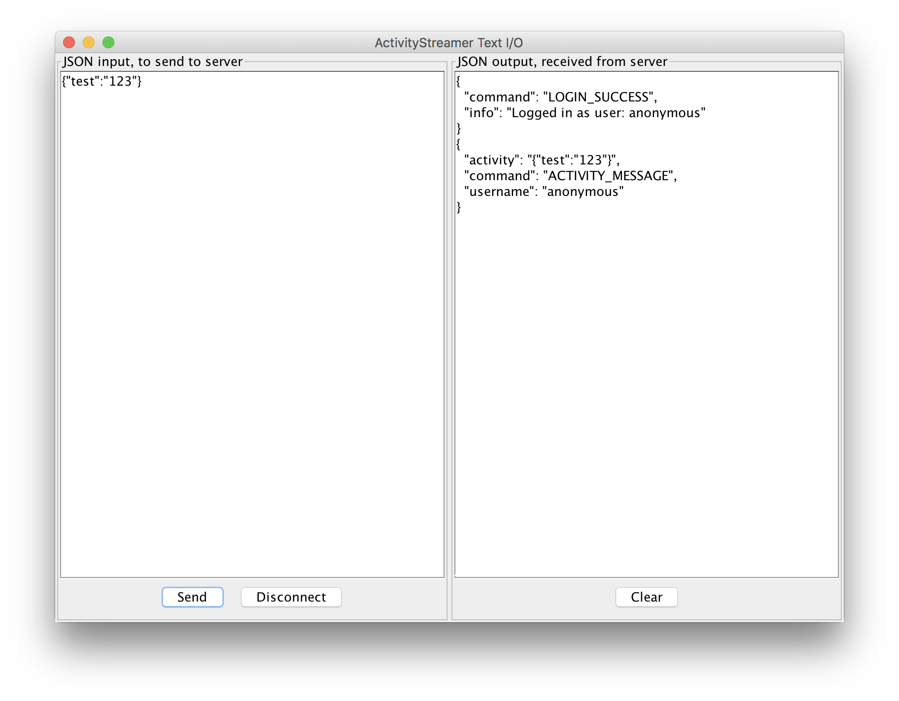

# Multiserver System
## Usage
### Optional Argument
#### Client
```
-u Set username of client
-rp Set remote port number
-rh Set remote hostname
-s Set secret
```
#### Server
```
-lp Set local port number
-rp Set remote port number
-rh Set remote hostname 
-lh Set local hostname
-a activity interval in milliseconds
-s secret for the server to use
```
### Implement
#### Server
First Set up the initiate server. The default local port number is 3780, and the local hostname is "localhost". Secret of the server would be printed in the terminal if secret optional argument has not been set.  
```
java -jar Server.jar
```  

Then, set up other servers connecting to exist server, by setting optional argument. Each server could only connect to ONE other server, in which way the multiserver system would finaly form a tree.
e.g. set up a second server connected to the initiate server, using the secret printed out by the first server:   
```
java -jar Server.jar -lp 3781 -rp 3780 -rh localhost -s 7v2t33guvtptiec3297d0vr1cl
```  

if all the server has been implemented successfully, each/every the server would receive `SERVER_ANOUNCE` from  all the other sever.

ATTENTION: This multiserver system assumed that servers never crash once started and they never quit. Once it happens, the whole system would shut down.

#### Client
Once the server system has been implemented, client could connected to any server. if no username and secret offered, client would log in as annonymous. if only username offered without secret, system would register for this username and generate a new secret which would be printed in the terminal. 
```
java -jar client.jar -rp 3780 -rh localhost -u Aaron
```  

When client log in successfully, client can send activity message by typing activity JSON in GUI. Any client connected to the server system would receied the activity message.


 
